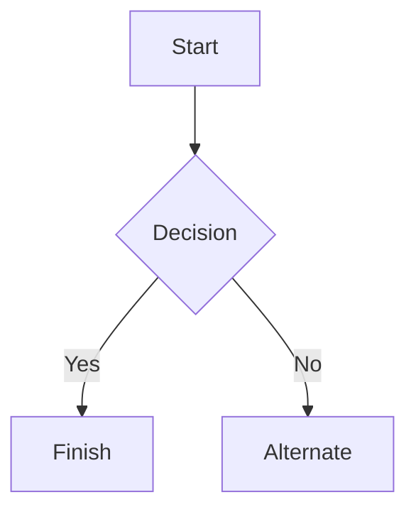

# ¿PORQUE LA SERIE DE BERSEK ES UNA TOTAL LOCURA?

## COMIENZO

###### LA HISTORIA DE GUST COMIENZA CON UN NIÑO DAÑADO POR SU FAMILIA  CON UNA EXTREMA POBREZA QUE LO OBLIGÓ A IR ALAS GUERRAS TERMINADAS CON TAL DE CONSEGUIR COMIDA Y LUCHAR POR LA MISMA COMIDA 

## Emphasi

*GUST SIEMPRE HA SIDO UN GUERRERO EN BUSCA DE LA  JUSTICIA *


_SIEMPRE HA AMADO A CASCA _

*Griffith*
__TRAICIONÓ A GUST SIENDO SU MEJOR AMIGO_
_You **can** combine them_

## Lists

### Unordered

* Item 1
* Item 2
* Item 2a
* Item 2b
    * Item 3a
    * Item 3b

### Ordered

1. Item 1
2. Item 2
3. Item 3
    1. Item 3a
    2. Item 3b

## Images


## Links

You may be using [Markdown Live Preview](https://markdownlivepreview.com/).

## Blockquotes

> Markdown is a lightweight markup language with plain-text-formatting syntax, created in 2004 by John Gruber with Aaron Swartz.
>
>> Markdown is often used to format readme files, for writing messages in online discussion forums, and to create rich text using a plain text editor.

## Tables

| Left columns  | Right columns |
| ------------- |:-------------:|
| left foo      | right foo     |
| left bar      | right bar     |
| left baz      | right baz     |

## Blocks of code

```
let message = 'Hello world';
alert(message);
```

## Mermaid diagrams


## Inline code

This web site is using `markedjs/marked`.
